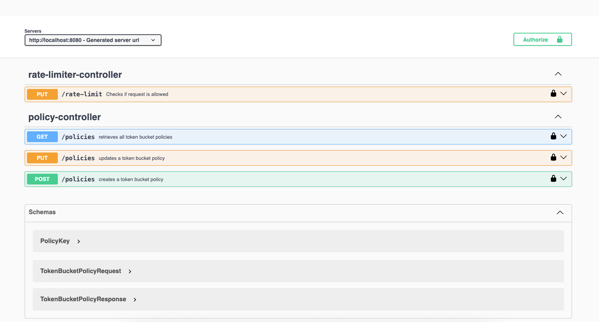
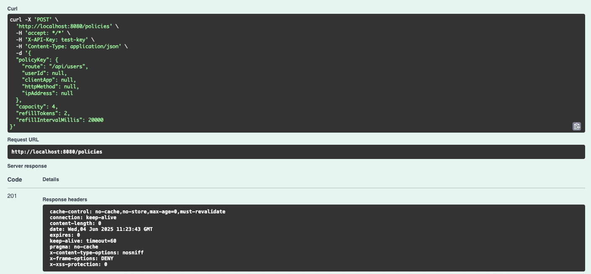
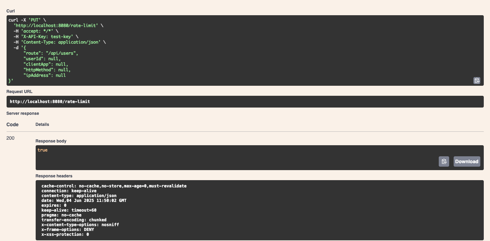
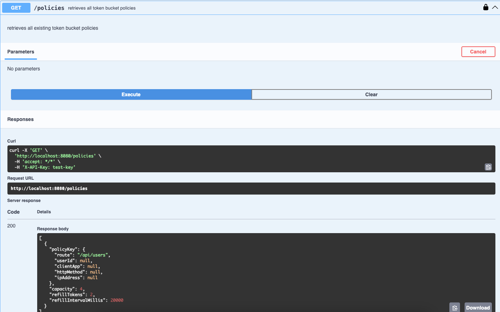
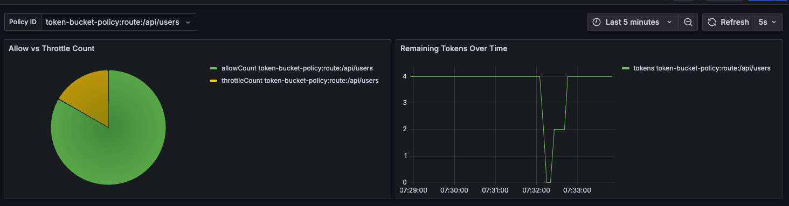

# Self-Hosted Redis Token-Bucket Rate Limiter
A drop-in, self-hosted API rate-limiter built with Spring Boot, Redis + Lua (token-bucket algorithm), and Grafana + InfluxDB for observability.


## Key points
- Token-bucket algorithm—supports bursts while enforcing a steady average rate.
- Policy-by-ID—string IDs can combine any of: route, userId, clientApp, httpMethod, ipAddress.
- Swagger UI—interactively test every endpoint.
- X-API-Key authentication—simple header-based auth for runtime checks.
- Pre-wired dashboards—Grafana panels for Allowed vs Throttled and Tokens Remaining over Time.
- One-command startup—docker compose up -d.

Perfect for personal APIs, internal microservices, hobby SaaS projects, or as a learning resource.

---

## Features

| Category        | Details                                                   |
|-----------------|----------------------------------------------------------|
| Algorithm       | Token bucket (atomic via Redis + Lua)                    |
| Key dimensions  | Any combination of route, userId, clientApp, httpMethod, ipAddress |
| Policy CRUD     | Create & update via REST                                 |
| Runtime checks  | `/api/ratelimit/check` drains/denies in real-time        |
| Auth            | X-API-Key header (simple allow-list)                     |
| Observability   | InfluxDB time-series + Grafana dashboards                |
| Docs / DX       | Swagger UI (`/swagger-ui.html`)                          |
| Packaging       | Docker Hub image + Compose stack                         |

---

## Quick Start

### 1. Clone repository
```bash

git clone git@github.com:GateControl/rate-limiter.git
cd rate-limiter
```

### 2. Change `example.env` to `.env` 
This sets up the .env file for docker-compose to use, feel free to set your own values for the environment variables
for more info see Environment Variables section

### 3. Spin up complete stack (Spring, Redis, InfluxDB, Grafana)
```bash

docker compose up -d
```

### 4. Open Swagger UI
Visit: [http://localhost:8080/swagger-ui.html](http://localhost:8080/swagger-ui.html)
set the Authorize X-API-Key with the value located in your .env file

### 5. Open Grafana (defaults: admin / admin)
Visit: [http://localhost:3000](http://localhost:3000)

---

## Environment Variables 

There is a example `.env` named `example.env` file in the project root with the following variables (or override them manually in `docker-compose.yml`), make sure to rename the
`example.env` to `.env` so the docker-compose.yml can read it:
You can also override other variables in the docker-compose file if you need to

Please do not change DOCKER_INFLUXDB_INIT_BUCKET, this will cause the grafana dashboards to not load. working on fixing this.

| Variable                       | Default                | Description                        |
|-------------------------------|------------------------|------------------------------------|
| DOCKER_INFLUXDB_INIT_PASSWORD | my-password            | InfluxDB admin password                  |
| DOCKER_INFLUXDB_INIT_ADMIN_TOKEN | my-token            | InfluxDB admin API token                 |
| ADMIN_API_KEY                | test-key               | Initial admin X-API-Key for authentication |
---

## REST API Overview
Can use the swagger ui  [http://localhost:8080/swagger-ui.html](http://localhost:8080/swagger-ui.html), note to make sure
to authorize the requests in the top right with the ADMIN_API_KEY you specified in the `.env` file. Also note that route
is a required parameter in the policyKey object.

### Create Policy


### Runtime Check

Returns `200 OK` or `429 Too Many Requests`. 

### GET Policies 

Provides policy details

---

## Dashboards
- Allowed vs Throttled pie chart (success vs. rejected).
- Remaining Tokens over time series graph to visualize bucket refill & drain.

All panels are auto-provisioned the first time Grafana starts (see `provisioning/`).

---

## Integration Test
See integration test createTokenBucketPolicyAndIsAllowedBehavior(), shows a policy with a capacity
of 2, and refill every 10 seconds of 1 token. You can see the first two requests pass and the third 
returns 429 Too Many Requests

---

## 🧠 How It Works

This rate limiter uses a mix of Redis (for fast atomic operations), Lua scripting (for efficiency and precision), and InfluxDB + Grafana (for metrics and observability). Here’s how the system flows:

### 🔄 Request Flow
1.	Runtime Check: Every incoming request hits a rate-limiting endpoint that:
*	Computes allowance using a Redis Lua script (token bucket algorithm).
*	Increments allowCount or throttleCount accordingly.
2.	Metrics Pipeline:
*	The Lua script pushes metrics to a Redis Stream.
*	A Spring Boot scheduled task consumes this stream and writes the data to InfluxDB.
3.	Token Tracking Over Time:
* Another scheduled task periodically iterates over all active token bucket policies. 
*	It runs a read-only Redis Lua script to compute current tokens available.
*	The result is also published to InfluxDB for time-series tracking.
4.	Observability via Grafana:
*	A pre-provisioned Grafana dashboard is included with the Docker setup.
*	Charts display:
*	AllowCount and ThrottleCount per policy
*	Tokens available over time (refill behavior and usage trends)

### 🔧 Technologies in Use
*	Redis + Lua: Atomic rate-limit calculations and efficient metrics collection
*	Redis Streams: Lightweight internal queue for metrics
*	Spring Boot: REST API, metrics consumer, and scheduled token polling
*	InfluxDB: Time-series database for long-term metrics
*	Grafana: Dashboards to visualize rate limit effectiveness and usage{b

---

## 🔌 Usage Examples
Here are some example rate-limit policies showcasing how to configure different throttling strategies using the `policyKey` structure:

For all uses, the policyKey "route" is a required parameter

### 🔸 Basic Rate Limit for Public API
Throttles anonymous traffic to a specific endpoint.
```json
{
  "policyKey": {
    "route": "/api/weather",
    "userId": null,
    "clientApp": null,
    "httpMethod": "GET",
    "ipAddress": null
  },
  "capacity": 60,
  "refillTokens": 60,
  "refillIntervalMillis": 60000
}
```

### 🔸 Per-User Rate Limit
Applies rate limiting specifically for a given user:
```json
{
  "policyKey": {
    "route": "/api/data",
    "userId": "user42",
    "clientApp": null,
    "httpMethod": null,
    "ipAddress": null
  },
  "capacity": 100,
  "refillTokens": 100,
  "refillIntervalMillis": 3600000
}
```
### 🔸 App/IP-Specific Limit
Limits access by known client application and IP address.
```json
{
  "policyKey": {
    "route": "/api/user", 
    "userId": null,
    "clientApp": "client",
    "httpMethod": null,
    "ipAddress": "10.0.0.1" 
  },
  "capacity": 100,
  "refillTokens": 100,
  "refillIntervalMillis": 3600000
}
```
Use `X-API-Key` in headers to authorize and hit `/rate-limit` to apply these policies.

## Hosted tier roadmap
- UI Dashboard for managing policies
- Slack / Webhook alerts
- SDKs 
- Role-based UI & teams 
- Usage-based billing integration 

---

## Contributing

Pull requests are welcome! For major changes, please open an issue first to discuss what you’d like to change.

```bash
git checkout -b feature/my-awesome-idea
make test  # run unit tests
```

---

## License

Licensed under the Apache License 2.0 — see LICENSE for details.